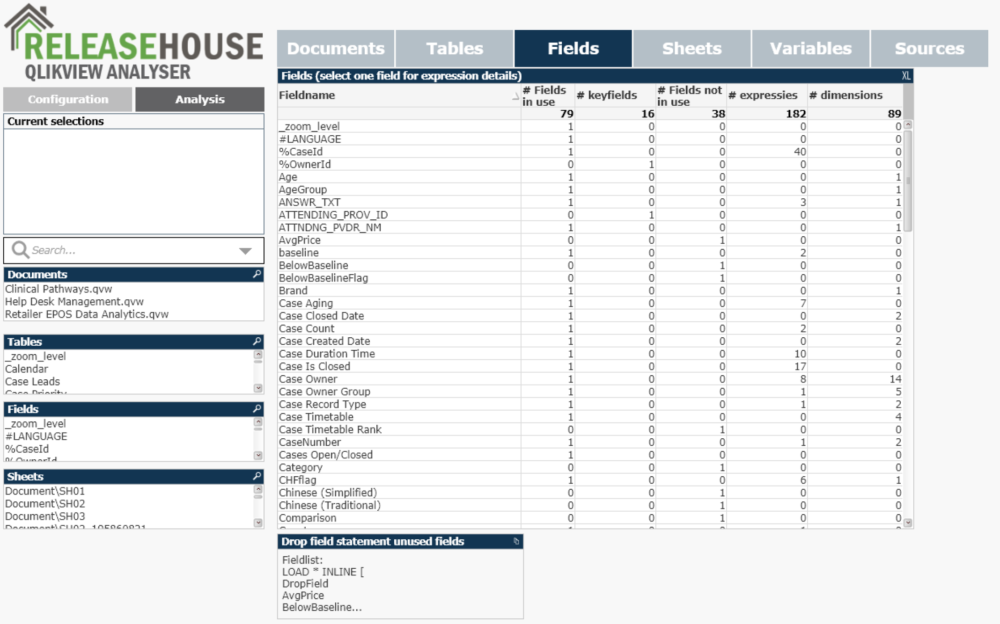

# QlikView-Analyser
With this QlikView file, you can analyse your complete QlikView envoirment.
You can schedule this file in your QMC and analyse your QlikView files on a daily basis.

So:
- No VBA script
- Reload it easily and quick on your QMC
- Scan multple documents or just one document
- Optional use of projectfiles for complete scan

With:
- Documents, Sheets, Tables, Fields, Objects, Variables
- Unused fields
- Used sources (and their sources)
- Sizes, No of fields, No of rows

# Versions
1.0
- Initial release
